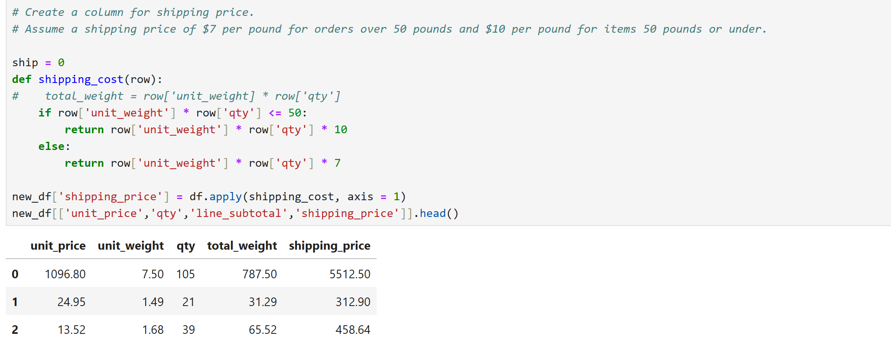
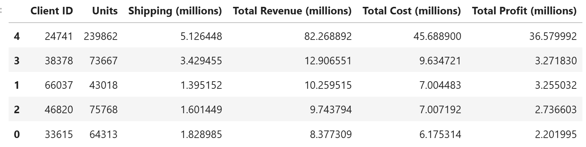

#pandas-challenge-1
# Module 4 Challenge
# Data Analysis of wholesale business

### Description
The application dives into a dataset from a an e-commerce company, to explore and analyze data to address real-world business questions viz. identifying top customers, popular product categories, calculating profits, and other similar data points. 

### Features
The file included in this folder utilized concepts related to importing public library viz. Panda, Numpy and others and utilized features of panda data frames to disect the data. The code was developed using Jupyter notebooks for advanced data analysis. 

The data is first explored to understand contents of dataset and key findings. 

Analysis of dataframes using value_counts function
category
consumables    23538
furniture      11915
software        8400
Name: count, dtype: int64

subcategory
bathroom supplies    6424
Name: count, dtype: int64

Top (5) client IDs passed to a list for future analysis. Shipping price is calculated using a function to calculate total shipping price based on weight of each order. 

 

The data is then transformed by way of adding new columns by using mathematical formulas using existing columns of the dataframe. Once all the required columns are added, a spot check is done for a few selected orders to ensure the calculations are done correctly.

Once the calculations are confirmed, dataframe is summarized and analyzed. For presentation purpose, financial figures are converted to millions and columns names are updated for ease of readability

### Concepts used

1. Importing Panda dataframe
2. Utilizing various functions and parameters of Panda
3. Adding new columns to existing dataframe
4. Using for loop to append designated columns for specific set of customers.  
5. Function to convert dollar columns to millions to make it easy to read
6. Sorting data frames

### Panda functions and parameters used
head(), columns, dtypes, .describe, value_counts(), .tolist(), .copy(),.sort_values()